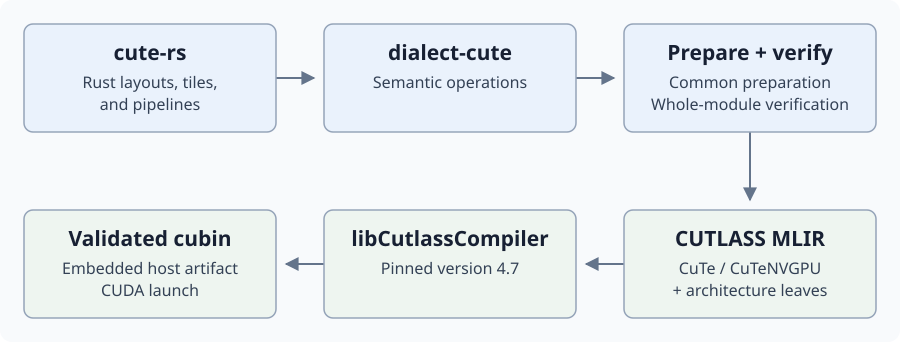

# Official CUTLASS translation backend

Compile Rust CuTe kernels with NVIDIA's pinned CUTLASS 4.7 compiler:



- Shared preparation keeps CuTe operations intact. The mapping packs translate
  them directly to the MLIR accepted by CUTLASS.
- Ordinary non-CuTe kernels retain the default MIR/NVVM/LLVM-to-PTX backend.

## Install and build

From the `cuda-oxide/` directory after normal CUDA Oxide setup:

```bash
cargo oxide toolchain install cutlass
export CUDA_OXIDE_DEVICE_BACKEND=cutlass-mlir

cargo oxide build elementwise_cute --arch sm_120a
cargo oxide build nvfp4_gemv_cute --arch sm_120a
cargo oxide build blockscale_gemm_cute --arch sm_120a
cargo oxide build fp16_gemm_256x352_cute --arch sm_100a
```

- Installation verifies both archive and library digests. `cargo oxide`
  resolves the managed compiler and fingerprints its library digest.
- An explicit absolute path overrides discovery; library loading still
  enforces the pinned digest:

```bash
CUDA_OXIDE_DEVICE_BACKEND=cutlass-mlir \
CUDA_OXIDE_CUTLASS_COMPILER=/absolute/path/to/libCutlassCompiler.so \
  cargo oxide build elementwise_cute --arch sm_120a
```

## Supported mappings

| Example | Compiler-visible operations |
| --- | --- |
| [Elementwise](../examples/elementwise_cute) | Tensor tiling and copying |
| [NVFP4 GEMV](../examples/nvfp4_gemv_cute) | Scaled tensor views and GEMV |
| [Block-scaled GEMM](../examples/blockscale_gemm_cute) | Scheduler, work tiles, TMA pipelines, shared-memory MMA, epilogue stores |
| [SM100 FP16 GEMM](../examples/fp16_gemm_256x352_cute) | Typed shared tiles, TMEM, paired two-CTA MMA, cluster TMA, producer/consumer pipelines |

At a block-scaled epilogue hand-off, `ReadyForTma` makes shared-memory writes
visible to TMA with an async-shared proxy fence, then emits a counted CTA
barrier. `Reusable` emits only the barrier.

Grid-constant references use the same launch convention as the native backend:

```text
#[grid_constant] desc: &TmaDesc<...>
host descriptor -> 128-byte launch argument -> device &TmaDesc<...>
                   aligned to 64 bytes        same address for every thread
```

The backend checks the cubin's argument sizes and offsets against this layout.
The descriptor needs no separate device allocation; the tensor allocations it
points to must remain valid until GPU work completes. See the
[grid-constant safety requirements](../../cuda-oxide-book/gpu-programming/kernels-and-device-functions.md#grid-constant-parameters)
for the full launch contract.

## SM100 contracts

The [Rust APIs](../cute-rs/src/sm100.rs) become verified `cute.sm100_*` plans:

| API | Contract |
| --- | --- |
| `Sm100SharedTile`, `TmaDesc<f16, Layout>` | Operand role and matching host/device layout |
| `Sm100TiledMma` | Two N partitions sharing A's collector lifetime |
| `Sm100TmaMmaPipeline`, `Sm100AccumulatorPipeline` | Buffer ownership and completion |
| `Sm100Tmem`, `Sm100TmemEpilogue` | TMEM allocation and FP32 → FP16 epilogue |

- **Compiler checks:** matching layouts and partitions, cluster transaction
  bytes, barrier arrivals, and the presence of allocation, MMA, copy, and
  release operations.
- **Caller responsibilities:** correct dynamic phases, participating lanes,
  and pointer lifetimes at each unsafe operation.
- **Profile:** two CTAs; FP16 inputs, FP32 accumulation; M256/K64;
  128-byte input swizzle; 512 TMEM columns; 128×32 epilogue with 64-byte swizzle.
  The example uses N192+160 and checks CPU FP32 accumulation rounded to FP16.

### CuTe and the A collector

- CUTLASS CuTe operations build shared descriptors, TMEM operations, and cluster TMA.
- CUTLASS 4.7's MMA atom cannot select when to fill or release the A collector.
  The backend emits an **NVVM TCGen05 MMA instruction** from the verified plan:

```text
Each K16:  first N partition → fill A collector
           second partition → last use of A collector
```

- Translation owns descriptor bits, instruction selection, barrier arrivals,
  completion multicast, and TMEM fences.

### Collective TMA loads

- `Sm100ClusterTmaCopy::copy`: all 32 producer lanes per CTA participate,
  with identical arguments within each warp; native CuTe elects internally.
- An outer elected-lane branch can deadlock on stage reuse. Regression cases
  cover more than five K stages and multiple persistent tiles.
- TMA **stores** have one issuing thread; the collective load rule does not apply.

## Diagnostics and limits

- `CUDA_OXIDE_DEVICE_BACKEND` accepts `native` or `cutlass-mlir`; unknown values
  fail. `CUDA_OXIDE_BACKEND` selects the rustc backend library, not this path.
- Unsupported semantics/profiles, verification failures, or compiler failures
  stop the build; translation does not fall back to another backend.
- To inspect prepared MLIR, add `CUDA_OXIDE_MLIR_OUTPUT="$PWD/module.mlir"`
  to a CUTLASS build. MLIR dumps and generated cubins are build artifacts;
  do not commit them.
